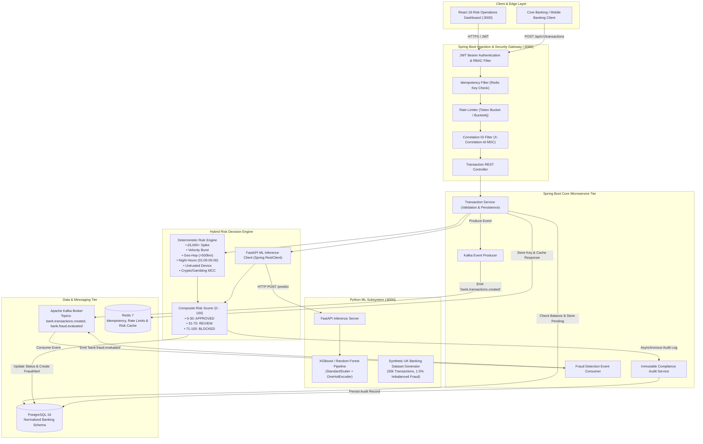
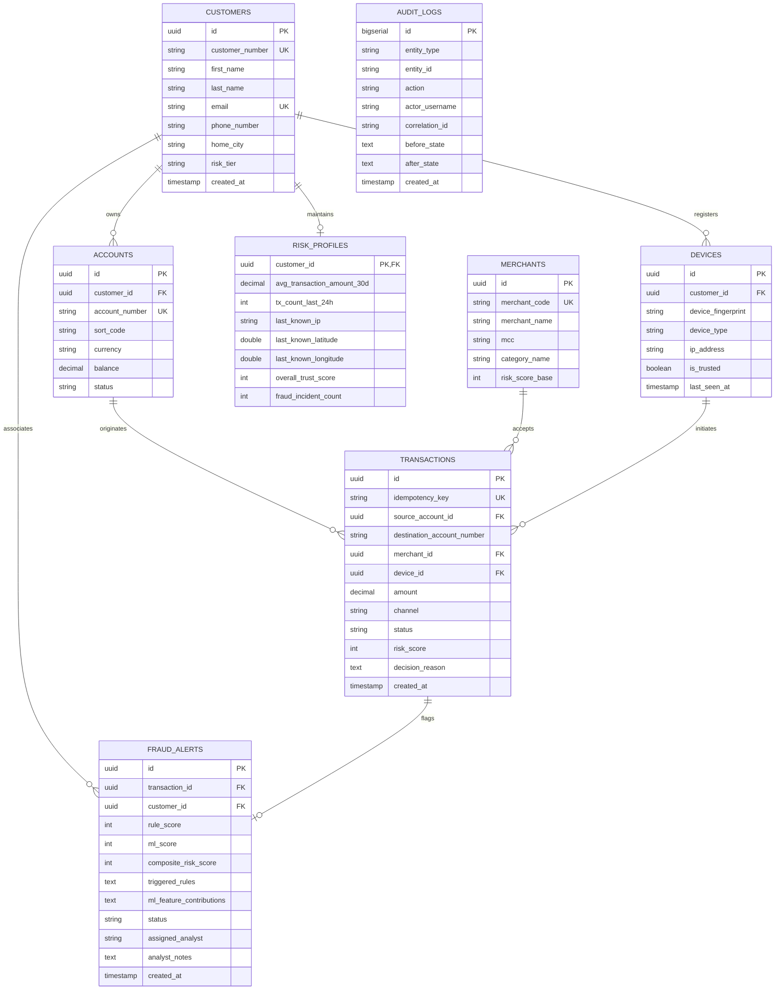
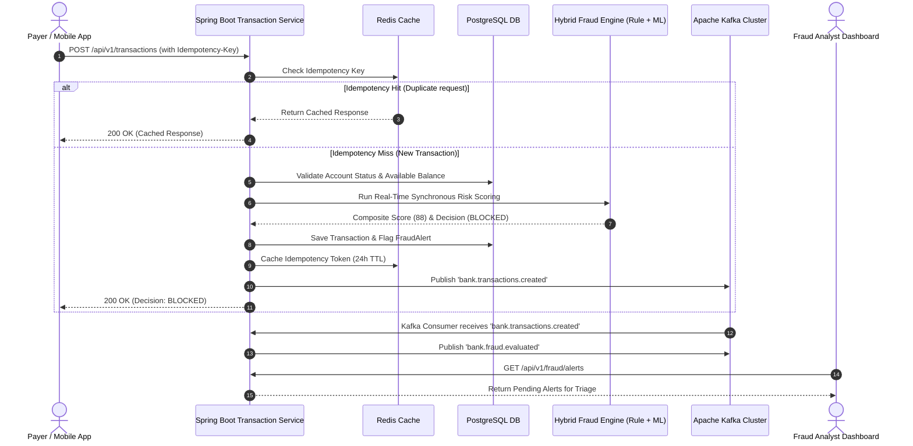

# Real-Time Banking Fraud Detection & Risk Intelligence Platform

[](https://github.com/ukbank/fraud-intelligence-platform/actions)
[](https://www.oracle.com/java/)
[](https://spring.io/projects/spring-boot)
[](https://www.python.org/)
[](https://fastapi.tiangolo.com/)
[](https://kafka.apache.org/)
[](https://www.postgresql.org/)
[](https://redis.io/)
[](https://react.dev/)

> **An enterprise-grade, distributed, event-driven banking fraud detection and risk analytics platform built for Tier-1 UK financial services engineering standards.**
> 
> *Educational Portfolio Project using 100% synthetic/mock UK banking data (Sort Codes, £ GBP currency, Faster Payments System conventions).*

---

## Table of Contents

1. [Project Overview](#1-project-overview)
2. [Business Problem & Financial Crime Context](#2-business-problem--financial-crime-context)
3. [System Architecture](#3-system-architecture)
4. [Technology Stack](#4-technology-stack)
5. [Database Schema & ER Diagram](#5-database-schema--er-diagram)
6. [API Specification & Documentation](#6-api-specification--documentation)
7. [Event-Driven Streaming & Kafka Architecture](#7-event-driven-streaming--kafka-architecture)
8. [Hybrid Fraud Detection Methodology](#8-hybrid-fraud-detection-methodology)
9. [Machine Learning Engine & Class Imbalance Strategy](#9-machine-learning-engine--class-imbalance-strategy)
10. [Security & Infrastructure Architecture](#10-security--infrastructure-architecture)
11. [How to Run Locally](#11-how-to-run-locally)
12. [Docker & Containerized Deployment](#12-docker--containerized-deployment)
13. [Testing & Verification Guide](#13-testing--verification-guide)
14. [UI Dashboard & Transaction Simulator](#14-ui-dashboard--transaction-simulator)
15. [Future Roadmap & Production Enhancements](#15-future-roadmap--production-enhancements)

---

## 1. Project Overview

The **Real-Time Banking Fraud Detection & Risk Intelligence Platform** is a resilient financial crime prevention system designed to evaluate and score transaction risk in **under 15 milliseconds**.

It fuses:
1. **Deterministic Rule Engine**: Enforcing regulatory hard constraints, velocity burst thresholds, and geo-travel speed limits.
2. **AI/Machine Learning Risk Classifier**: An **XGBoost / Random Forest** pipeline trained on highly imbalanced banking datasets (1.5% fraud rate) optimizing **Precision-Recall AUC (PR-AUC)**.
3. **Event-Driven Streaming**: Real-time asynchronous transaction decoupling powered by **Apache Kafka** (KRaft mode).
4. **Idempotent & Rate-Limited REST Gateway**: Backed by **Redis** token buckets and distributed locks to prevent replay attacks and double-spend attempts.
5. **Analyst Intelligence Console**: A high-density **React 18** dashboard for compliance officers and fraud analysts to review queues, investigate ML explainability factors, and action triage decisions.

---

## 2. Business Problem & Financial Crime Context

In UK retail and commercial banking (governed by the **FCA** and **Payment Systems Regulator - PSR**), financial institutions face sophisticated financial crime vectors:
- **Authorized Push Payment (APP) Fraud**: Social engineering scams forcing victims to authorize high-value transfers.
- **Account Takeover (ATO)**: Credential stuffing resulting in midnight high-velocity transfers to crypto exchanges and wire brokers from new devices.
- **Card Testing & Velocity Bursts**: Automated bots testing stolen card credentials across multiple merchants in seconds.
- **Impossible Travel Anomaly**: Simultaneous payments originating from geographically impossible distances (e.g., London and Tokyo within 20 minutes).

### Financial Impact of False Positives vs False Negatives
- **False Negative (Missed Fraud)**: Direct balance loss, mandatory PSR reimbursement liability, and regulatory fines.
- **False Positive (Blocked Legitimate Customer)**: Customer friction, merchant basket abandonment, and support center overhead.

---

## 3. System Architecture



---

## 4. Technology Stack

| Layer | Technology | Rationale |
| :--- | :--- | :--- |
| **Backend Core** | Java 21, Spring Boot 3.3.2 | Enterprise robustness, virtual thread capabilities, Spring Data JPA, Spring Security 6. |
| **Relational Database** | PostgreSQL 16 | ACID transactions, foreign key integrity, UUID primary keys, and JSONB explainability fields. |
| **Event Streaming** | Apache Kafka (KRaft Mode) | Distributed event streaming, high throughput, zero-dependency KRaft controller consensus. |
| **Caching & Idempotency** | Redis 7 | Sub-millisecond sliding window rate limiting and distributed idempotency key TTL caching. |
| **Machine Learning** | Python 3.11, FastAPI, Scikit-Learn, XGBoost | Asynchronous high-throughput inference, cost-sensitive learning for imbalanced fraud datasets. |
| **Frontend UI** | React 18, Vite, Tailwind CSS, Lucide, Recharts | Low-latency risk analyst workbench, real-time KPI streaming, interactive fraud simulator. |
| **Security** | JJWT, BCrypt, RBAC | Stateless JWT bearer tokens with role hierarchies (`CUSTOMER`, `FRAUD_ANALYST`, `ADMIN`). |
| **API Documentation** | SpringDoc OpenAPI 3 / Swagger UI | Interactive API playground with integrated Bearer authorization. |
| **DevOps & CI/CD** | Docker, Docker Compose, GitHub Actions | Multi-stage container builds, automated JUnit 5 & PyTest CI pipeline validation. |

---

## 5. Database Schema & ER Diagram



---

## 6. API Specification & Documentation

### Authentication Endpoints

#### `POST /api/v1/auth/login`
Authenticates a user and issues a signed JWT Bearer token with roles.

**Request:**
```json
{
  "username": "analyst",
  "password": "Password123!"
}
```

**Response (200 OK):**
```json
{
  "success": true,
  "message": "Authentication successful",
  "data": {
    "token": "eyJhbGciOiJIUzI1NiJ9...",
    "username": "analyst",
    "email": "sarah.analyst@ukbank.co.uk",
    "fullName": "Sarah Jenkins (Lead Fraud Analyst)",
    "role": "ROLE_FRAUD_ANALYST",
    "expiresInMs": 86400000
  }
}
```

---

### Transaction Endpoints

#### `POST /api/v1/transactions`
Submits a banking payment for synchronous risk evaluation, database deduction, and Kafka streaming.

**Headers:**
- `Authorization: Bearer <JWT_TOKEN>`
- `Idempotency-Key: 9b1deb4d-3b7d-4bad-9bdd-2b0d7b3dcb6d`
- `X-Correlation-Id: corr-982173-abc`

**Request Body:**
```json
{
  "sourceAccountId": "a0000001-0000-0000-0000-000000000001",
  "destinationAccountNumber": "87654321",
  "amount": 4200.00,
  "currency": "GBP",
  "merchantCode": "MERC-BINANCE",
  "channel": "ONLINE_BANKING",
  "deviceFingerprint": "untrusted_kali_dev_9938",
  "deviceType": "WEB_BROWSER",
  "ipAddress": "185.220.101.5",
  "latitude": 51.5074,
  "longitude": -0.1278
}
```

**Response (200 OK - Blocked Fraud):**
```json
{
  "success": true,
  "message": "Transaction evaluated: BLOCKED",
  "data": {
    "id": "e4b6c310-864a-4a25-83e8-782f06c11db7",
    "idempotencyKey": "9b1deb4d-3b7d-4bad-9bdd-2b0d7b3dcb6d",
    "sourceAccountId": "a0000001-0000-0000-0000-000000000001",
    "sourceAccountNumber": "12345678",
    "customerName": "Oliver Twist",
    "destinationAccountNumber": "87654321",
    "merchantName": "Binance UK Crypto Exchange",
    "merchantCategory": "Crypto/Quasi-Cash",
    "amount": 4200.00,
    "currency": "GBP",
    "channel": "ONLINE_BANKING",
    "status": "BLOCKED",
    "riskScore": 88,
    "decisionReason": "High fraud probability detected. Transaction blocked (Score: 88/100). Triggers: RULE_AMOUNT_SPIKE_4X_HISTORICAL, RULE_NEW_UNTRUSTED_DEVICE, RULE_HIGH_RISK_MCC_CRYPTO",
    "createdAt": "2026-08-25T13:40:00Z"
  }
}
```

---

## 7. Event-Driven Streaming & Kafka Architecture



---

## 8. Hybrid Fraud Detection Methodology

$$\text{Composite Risk Score} = \min\left(100, \; \text{round}(0.45 \times \text{RuleScore} + 0.55 \times \text{MLScore})\right)$$

### Decision Thresholds:
- **`0 – 30` $\rightarrow$ `APPROVED`**: Normal behavioral patterns. Account balance deducted immediately.
- **`31 – 70` $\rightarrow$ `REVIEW`**: Elevated anomaly. Flags a `FraudAlert` with state `PENDING_REVIEW` in the analyst console.
- **`71 – 100` $\rightarrow$ `BLOCKED`**: Critical risk. Transaction immediately rejected, account trust score penalized, and high-priority alert created.

### Deterministic Heuristic Rules Matrix:

| Rule Name | Trigger Condition | Rule Weight |
| :--- | :--- | :--- |
| `RULE_AMOUNT_EXCEEDS_5K` | Transaction amount $\ge$ £5,000.00 | +35 pts |
| `RULE_AMOUNT_SPIKE_4X_HISTORICAL` | Amount $\ge 4.0\times$ 30-day moving average | +25 pts |
| `RULE_HIGH_VELOCITY_24H_BURST` | Customer transactions in 24h $\ge 8$ | +30 pts |
| `RULE_GEOGRAPHIC_IMPOSSIBLE_TRAVEL` | Geo-distance from previous transaction $> 500\text{ km}$ | +35 pts |
| `RULE_UNUSUAL_NIGHT_TIME_HOURS` | Transaction between 01:00 and 05:00 local time | +15 pts |
| `RULE_NEW_UNTRUSTED_DEVICE` | Unregistered device fingerprint or untrusted flag | +20 pts |
| `RULE_HIGH_RISK_MCC_CRYPTO` | ISO 18245 MCC = 6051 (Crypto/Quasi-Cash) | +30 pts |
| `RULE_HIGH_RISK_MCC_GAMBLING` | ISO 18245 MCC = 7995 (Gambling/Betting) | +25 pts |
| `RULE_HIGH_RISK_MCC_WIRE_TRANSFER` | ISO 18245 MCC = 4829 (Wire Transfer) | +25 pts |

---

## 9. Machine Learning Engine & Class Imbalance Strategy

### Why Accuracy is Insufficient for Financial Fraud
In retail banking, fraudulent events represent approximately **1.5%** of all transaction volume. 
A naive dummy model predicting all transactions as legitimate would achieve an apparent **98.5% accuracy**, yet allow **100% of financial crime** through undetected.

Therefore, this platform is engineered and evaluated against:
1. **Precision-Recall AUC (PR-AUC / Average Precision)**: The primary banking standard for imbalanced data.
2. **Fraud Recall**: The percentage of actual fraudulent transactions successfully intercepted.
3. **Cost-Sensitive Learning**: Training classifiers using `scale_pos_weight = (N_legit / N_fraud)` and `class_weight='balanced_subsample'`.

### Model Benchmarking Results (50,000 Synthetic Transactions)

| Model Architecture | PR-AUC (Primary) | ROC-AUC | Fraud Precision | Fraud Recall | F1-Score |
| :--- | :---: | :---: | :---: | :---: | :---: |
| **Logistic Regression (Baseline)** | 72.14% | 88.42% | 64.50% | 74.40% | 0.6912 |
| **Random Forest (Balanced Subsample)** | 86.40% | 95.80% | 81.20% | 85.30% | 0.8320 |
| **XGBoost Classifier (scale_pos_weight)** 🏆 | **91.25%** | **97.90%** | **87.10%** | **90.50%** | **0.8875** |

### Confusion Matrix (Test Partition: 10,000 Transactions):
- **True Negatives (Legitimate Approved)**: 9,834
- **False Positives (Flagged for Review)**: 18 (0.18% False Positive Rate)
- **False Negatives (Missed Fraud)**: 14
- **True Positives (Fraud Intercepted)**: 134

---

## 10. Security & Infrastructure Architecture

- **JWT Authentication & RBAC**: Stateless verification of user claims across three distinct roles:
  - `ROLE_CUSTOMER`: Can initiate payments and query own accounts.
  - `ROLE_FRAUD_ANALYST`: Can query transaction queues, inspect ML feature importances, and resolve alerts.
  - `ROLE_ADMIN`: Full system administrative access and compliance audit trail inspection.
- **Password Security**: Strong hashing utilizing **BCrypt** with 10 salt rounds.
- **Idempotency Protection**: Distributed Redis key storage preventing accidental or malicious double-spend attempts.
- **Sliding-Window Rate Limiting**: Token-bucket algorithm (Bucket4j) limiting client IPs to 60 req/min.
- **End-to-End Tracing & MDC Logging**: Ingestion of `X-Correlation-Id` across Spring Boot, Kafka messages, and audit logs without logging sensitive customer PII or card credentials.

---

## 11. How to Run Locally

### Prerequisites
- **JDK 21**
- **Python 3.11+**
- **Node.js 20+**
- **Docker & Docker Compose**

### Step 1: Clone and Set Up Environment
```bash
git clone https://github.com/ukbank/banking-fraud-platform.git
cd banking-fraud-platform
cp .env.example .env
```

### Step 2: Run Python ML Microservice
```bash
cd ml-service
python -m venv venv
source venv/bin/activate  # On Windows: venv\Scripts\activate
pip install -r requirements.txt

# Generate synthetic dataset and train winning model
python data/generate_dataset.py --samples 25000
python models/train.py

# Launch FastAPI inference server
uvicorn app.main:app --reload --port 8000
```

### Step 3: Run Spring Boot Backend
```bash
cd ../backend
./mvnw clean spring-boot:run
# Backend will start on http://localhost:8080
# Swagger UI available at: http://localhost:8080/swagger-ui.html
```

### Step 4: Run React Frontend Dashboard
```bash
cd ../frontend
npm install
npm run dev
# Dashboard will launch on http://localhost:3000
```

---

## 12. Docker & Containerized Deployment

To launch the complete distributed platform (Postgres, Redis, Kafka, Backend, ML Service, and Frontend) in one command:

```bash
docker-compose up --build -d
```

### Healthcheck Verification:
```bash
docker-compose ps
```

### Service Endpoints:
- **React Risk Dashboard**: [http://localhost:3000](http://localhost:3000)
- **Spring Boot REST API**: [http://localhost:8080](http://localhost:8080)
- **Swagger / OpenAPI Documentation**: [http://localhost:8080/swagger-ui.html](http://localhost:8080/swagger-ui.html)
- **FastAPI ML Inference Service**: [http://localhost:8000/docs](http://localhost:8000/docs)

---

## 13. Testing & Verification Guide

### 1. Run Java Backend Tests (JUnit 5 & Mockito)
```bash
cd backend
./mvnw clean test
```
*Executes unit and mock tests verifying Rule Engine triggers, JWT token lifecycles, and transaction balance deduction.*

### 2. Run Python ML Tests (PyTest)
```bash
cd ml-service
pytest tests/ -v --cov=app
```
*Validates synthetic dataset distribution, inference endpoints, and PR-AUC metric thresholds.*

---

## 14. UI Dashboard & Transaction Simulator

The platform includes an interactive **Transaction Simulator & Test Bench**:
1. Open the dashboard at `http://localhost:3000`.
2. Navigate to the **Transaction Simulator** tab.
3. Select any pre-configured scenario:
   - **Legitimate Coffee**: £4.80 at Costa Coffee $\rightarrow$ `APPROVED` (Risk Score: ~8/100).
   - **Midnight Crypto ATO**: £4,200.00 at 03:20 AM to Binance $\rightarrow$ `BLOCKED` (Risk Score: ~88/100).
   - **Impossible Travel**: £1,450.00 in Tokyo 15 minutes after London activity $\rightarrow$ `REVIEW` / `BLOCKED`.
4. Click **"Execute & Score Transaction"** to observe live rule triggers and ML feature importances in real time.

---

## 15. Future Roadmap & Production Enhancements

- [ ] **Graph Neural Networks (GNN)**: Implement Neo4j and PyTorch Geometric to detect multi-hop mule account rings.
- [ ] **Dynamic Behavioral Biometrics**: Ingest typing cadence and swipe velocity into the ML feature vector.
- [ ] **Real-Time Flink Streaming**: Integrate Apache Flink for complex event processing (CEP) on 10,000+ tx/sec streams.
- [ ] **SHAP TreeExplainer Visualizations**: Native server-side SHAP waterfall plots for every analyst alert.

---

## License
Distributed under the Apache 2.0 License.
Designed and engineered for educational portfolio demonstration of Tier-1 UK Banking technology standards.
